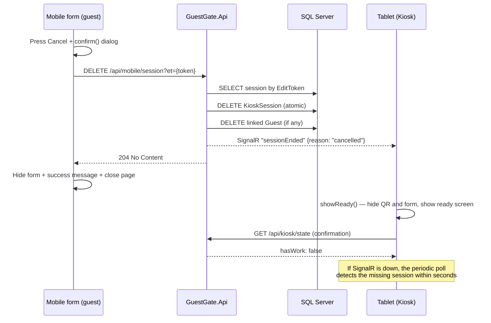

# Cancel Button Flow — What Exactly Happens?

When the user presses **Cancel**, the session (`KioskSession`) is **permanently deleted from the database**, together with any guest data linked to it (the `Guest` row). The kiosk is then notified immediately over SignalR and returns to its ready screen. No trace of the cancelled session remains.

There are two Cancel buttons in the system:

| Button | Location | API it calls |
|---|---|---|
| **Cancel** on the tablet (kiosk.html) | Below the session form, next to the QR code | `DELETE /api/sessions/active?kid={kid}` |
| **Cancel** on the mobile form (mobile.html) | Action bar below the form (next to Submit) | `DELETE /api/mobile/session?et={editToken}` |

---

## 1) Cancelling from the tablet (kiosk)

**Endpoint:** `DELETE /api/sessions/active?kid={kid}` — defined in `Endpoints/SessionManagementEndpoints.cs`.

What the server does, in order:

1. Fetches all **active** sessions (`Status = Active`) for this kiosk (`Kid`) — a lightweight no-tracking read (`AsNoTracking`).
2. Hard-deletes them with a single atomic `ExecuteDeleteAsync` statement (not a status change to Cancelled — **the row is removed permanently**).
3. If any of those sessions has a linked `GuestId`, the corresponding `Guest` row (the saved form data) is deleted as well.
4. Broadcasts a SignalR event for every deleted session to the kiosk group:

   ```json
   // event: "sessionEnded" → group: kiosk-{kid}
   { "kid": 1, "sessionId": 42, "reason": "cancelled" }
   ```

5. Returns `204 No Content` — even when no active session existed (the operation is idempotent).

> Note: the legacy endpoint `POST /api/sessions/cancel?kid=` uses the same purge logic, but returns `404` when there is no active session.

## 2) Cancelling from the mobile form (guest)

**Endpoint:** `DELETE /api/mobile/session?et={editToken}` — defined in `Endpoints/GuestFlowEndpoints.cs`.

What the server does, in order:

1. Looks up the session by its `EditToken` (the GUID embedded in the QR link — only this guest has it).
2. Not found? Returns `204` right away (idempotent — pressing twice or racing another cancel never errors).
3. Found? Hard-deletes the `KioskSession` row with `ExecuteDeleteAsync`.
4. Deletes the linked `Guest` row if one exists (in case the guest had already submitted their data).
5. Broadcasts the same `sessionEnded` event with `reason: "cancelled"` to the kiosk group.
6. Returns `204 No Content`.

**Mobile page behaviour** (mobile.html):

- Before sending, a warning `confirm()` is shown: the session and all entered data will be permanently deleted.
- While the request is in flight, both Cancel and Submit buttons are disabled and a "Cancelling..." message is shown.
- On success (`204`): the form is hidden, "Session cancelled. You can close this page." is shown, and the page auto-closes after 1.5 seconds.
- On a network failure: an error message appears and both buttons are re-enabled so the guest can retry.

---

## How does the tablet (kiosk) react to a cancel?

The kiosk learns about the cancellation through **two parallel channels** (primary + fallback):

### Primary channel — SignalR (instant)

kiosk.html has a listener:

```js
hub.on('sessionEnded', p => { ... showReady(); checkKioskState(true); });
```

- If the event's `sessionId` matches the session currently displayed → `showReady()`: hides the form and QR, stops the expiry timers, resets state (`currentEt`, `currentSessionId`), and shows the ready/screensaver screen.
- Then `checkKioskState(true)` runs an immediate poll to confirm no other work is pending (e.g. a waiting consent).

### Fallback channel — periodic polling (when SignalR is down)

The kiosk polls `GET /api/kiosk/state?kid=` every few seconds (driven by `nextPollMs`). After the delete, the server finds no active session and returns:

```json
{ "hasWork": false, "nextPollMs": 5000, "consent": null, "session": null }
```

The kiosk then calls `showReady()` automatically. In other words, even with SignalR completely disconnected, the tablet returns to its ready screen within at most one polling interval.

> On the tablet itself, the Cancel button doesn't wait for either channel: it calls `showReady()` locally as soon as the request succeeds.

---

## Sequence diagram



---

## Edge cases

| Case | Behaviour |
|---|---|
| Cancel pressed twice / simultaneous cancel from both devices | Idempotent — the second request finds the session already deleted and returns `204` with no error |
| Session expired before the cancel | If still Active it is deleted normally; if it already flipped to Expired, the mobile cancel (by token) still deletes it, while the tablet cancel (Active only) returns `204` with no effect |
| Guest submitted the form, then pressed Cancel using the old link | The session **and the guest data linked to it** are deleted — this is intentional (right to erasure) |
| Network failure during the mobile cancel | Error message + buttons re-enabled for retry; nothing changes on the server |
| SignalR disconnected from the tablet | The periodic `/api/kiosk/state` poll returns the tablet to ready within one polling interval |

## Developer notes

- Deletion uses atomic `ExecuteDeleteAsync` statements (no Serializable transactions) — the same deadlock-prevention pattern applied across the rest of the system.
- `EnableRetryOnFailure` is enabled in `Program.cs`, so any transient error (deadlock 1205 or a momentary disconnect) is retried automatically up to 5 times.
- The `sessionEnded` event is also used for other reasons (`reason: "expired"` when a session times out) — the tablet treats them all the same way: return to ready, then run a confirmation poll.
