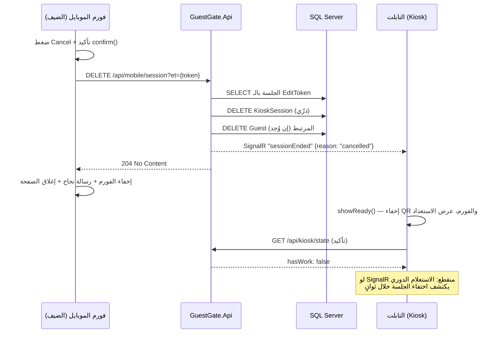

# تدفق زر الإلغاء (Cancel) — ماذا يحدث بالضبط؟

عند الضغط على زر **Cancel** تُحذف الجلسة (KioskSession) **حذفاً فعلياً من قاعدة البيانات** مع أي بيانات ضيف مرتبطة بها (صف Guest)، ثم يُبلَّغ الكيوسك فوراً عبر SignalR ليعود لشاشة الاستعداد. لا يبقى أي أثر للجلسة الملغاة.

يوجد زران للإلغاء في النظام:

| الزر | مكانه | الـ API التي يستدعيها |
|---|---|---|
| **Cancel** في التابلت (kiosk.html) | أسفل فورم الجلسة بجانب الـ QR | `DELETE /api/sessions/active?kid={kid}` |
| **Cancel** في فورم الموبايل (mobile.html) | شريط الأزرار أسفل الفورم (بجانب Submit) | `DELETE /api/mobile/session?et={editToken}` |

---

## 1) الإلغاء من التابلت (الكيوسك)

**النقطة:** `DELETE /api/sessions/active?kid={kid}` — معرّفة في `Endpoints/SessionManagementEndpoints.cs`.

ما يفعله الخادم بالترتيب:

1. يجلب كل الجلسات **النشطة** (`Status = Active`) لهذا الكيوسك (`Kid`) — قراءة خفيفة بدون تتبّع (`AsNoTracking`).
2. يحذفها حذفاً فعلياً بجملة ذرّية واحدة `ExecuteDeleteAsync` (ليس تغيير حالة إلى Cancelled — **حذف الصف نهائياً**).
3. إن كان لأي جلسة منها `GuestId` مرتبط، يُحذف صف الـ `Guest` أيضاً (بيانات الفورم المحفوظة).
4. يبث حدث SignalR لكل جلسة محذوفة إلى مجموعة الكيوسك:

   ```json
   // event: "sessionEnded" → group: kiosk-{kid}
   { "kid": 1, "sessionId": 42, "reason": "cancelled" }
   ```

5. يرجع `204 No Content` — حتى لو لم توجد جلسة نشطة أصلاً (العملية idempotent).

> ملاحظة: النقطة القديمة `POST /api/sessions/cancel?kid=` ما زالت تعمل بنفس منطق الحذف، لكنها ترجع `404` إن لم توجد جلسة نشطة.

## 2) الإلغاء من فورم الموبايل (الضيف)

**النقطة:** `DELETE /api/mobile/session?et={editToken}` — معرّفة في `Endpoints/GuestFlowEndpoints.cs`.

ما يفعله الخادم بالترتيب:

1. يبحث عن الجلسة بالـ `EditToken` (الـ GUID الموجود في رابط الـ QR — لا يملكه إلا هذا الضيف).
2. غير موجودة؟ يرجع `204` فوراً (idempotent — تكرار الضغط أو سباق إلغاءين لا يسبب خطأ).
3. موجودة؟ يحذف صف `KioskSession` نهائياً بـ `ExecuteDeleteAsync`.
4. يحذف صف `Guest` المرتبط إن وُجد (لو كان الضيف قد أرسل بياناته قبلها).
5. يبث نفس حدث `sessionEnded` بـ `reason: "cancelled"` لمجموعة الكيوسك.
6. يرجع `204 No Content`.

**تفاعل صفحة الموبايل** (mobile.html):

- قبل الإرسال يظهر `confirm()` تحذيري: «سيتم حذف الجلسة وكل البيانات المدخلة نهائياً».
- أثناء الطلب يُعطَّل زرا Cancel وSubmit وتظهر رسالة "Cancelling...".
- عند النجاح (`204`): يُخفى الفورم، تظهر "Session cancelled. You can close this page."، وتُغلق الصفحة تلقائياً بعد 1.5 ثانية.
- عند فشل الشبكة: تظهر رسالة خطأ ويُعاد تفعيل الزرين ليحاول مجدداً.

---

## كيف يتفاعل التابلت (الكيوسك) مع الإلغاء؟

الكيوسك يعرف بالإلغاء عبر **قناتين متوازيتين** (الأساسية + الاحتياطية):

### القناة الأساسية — SignalR (لحظية)

في kiosk.html يوجد مستمع:

```js
hub.on('sessionEnded', p => { ... showReady(); checkKioskState(true); });
```

- إن كان `sessionId` في الحدث هو الجلسة المعروضة حالياً → `showReady()`: إخفاء الفورم والـ QR، إيقاف مؤقّتات الانتهاء، تصفير الحالة (`currentEt`, `currentSessionId`)، وإظهار شاشة الاستعداد/الـ screensaver.
- ثم `checkKioskState(true)` استعلام فوري للتأكد من عدم وجود عمل آخر (موافقة معلّقة مثلاً).

### القناة الاحتياطية — الاستعلام الدوري (عند انقطاع SignalR)

الكيوسك يستعلم `GET /api/kiosk/state?kid=` كل بضع ثوانٍ (حسب `nextPollMs`). بعد الحذف لن يجد الخادم أي جلسة نشطة فيرجع:

```json
{ "hasWork": false, "nextPollMs": 5000, "consent": null, "session": null }
```

فيستدعي الكيوسك `showReady()` تلقائياً. أي حتى لو كان SignalR منقطعاً تماماً، أقصى تأخير لعودة التابلت لشاشة الاستعداد هو فاصل استعلام واحد.

> في التابلت نفسه، زر Cancel لا ينتظر أياً من القناتين: يستدعي `showReady()` محلياً فور نجاح الطلب.

---

## مخطط التسلسل



---

## الحالات الطرفية

| الحالة | السلوك |
|---|---|
| ضغط Cancel مرتين / إلغاء متزامن من الجهازين | العملية idempotent — الطلب الثاني يجد الجلسة محذوفة ويرجع `204` بلا خطأ |
| الجلسة انتهت صلاحيتها قبل الإلغاء | إن كانت ما زالت Active تُحذف عادي؛ إن كانت تحولت Expired فالإلغاء من الموبايل (بالـ token) يحذفها أيضاً، ومن التابلت (Active فقط) يرجع `204` بلا تأثير |
| الضيف أرسل البيانات (Submit) ثم ضغط Cancel بالرابط القديم | تُحذف الجلسة **وبيانات الضيف المرتبطة بها** — هذا مقصود (حق محو البيانات) |
| فشل الشبكة أثناء الإلغاء من الموبايل | رسالة خطأ + إعادة تفعيل الأزرار للمحاولة مجدداً؛ لا يتغير شيء في الخادم |
| SignalR منقطع عن التابلت | الاستعلام الدوري لـ `/api/kiosk/state` يعيد التابلت للاستعداد خلال فاصل استعلام واحد |

## ملاحظات للمطوّر

- الحذف يتم بجمل `ExecuteDeleteAsync` ذرّية (بدون معاملات Serializable) — نفس نمط منع الـ deadlocks المطبق في بقية النظام.
- `EnableRetryOnFailure` مفعّل في `Program.cs`، فأي خطأ عابر (deadlock 1205 أو انقطاع لحظي) يُعاد تلقائياً حتى 5 محاولات.
- حدث `sessionEnded` نفسه يُستخدم أيضاً لأسباب أخرى (`reason: "expired"` عند انتهاء الصلاحية) — التابلت يعامل الجميع بنفس الطريقة: عودة للاستعداد ثم استعلام تأكيدي.
